# Week 4 — Azure Data Factory: End-to-End Data Pipeline

**Objective:** Build an end-to-end data pipeline using Azure Storage Account and Azure Data Factory (Blob → ADF → Destination) with metadata validation and IAM access control.  
**Dataset:** [Superstore Dataset](https://www.kaggle.com/datasets/vivek468/superstore-dataset-final) (50-row sample — `superstore_sample.csv`)

---

## Architecture Overview

```
┌─────────────────────────────────────────────────────────────────────────┐
│                    Resource Group: rg-celebal-assignment4               │
│                                                                         │
│  ┌──────────────────┐         ┌─────────────────────────────────────┐  │
│  │  Storage Account │         │     Azure Data Factory (V2)         │  │
│  │  stcelebalassign4│◄───────►│     adf-celebal-assign4             │  │
│  │                  │  Linked │                                     │  │
│  │ ┌──────────────┐ │ Service │  ┌───────────────────────────────┐  │  │
│  │ │ source-data  │ │ (Blob)  │  │  Pipeline:                    │  │  │
│  │ │  .csv file   │─┼────────►│  │  pl_blob_copy_with_validation │  │  │
│  │ └──────────────┘ │         │  │                               │  │  │
│  │                  │         │  │  [Get Metadata]               │  │  │
│  │ ┌──────────────┐ │         │  │       │                       │  │  │
│  │ │ dest-data    │◄┼────────┤│  │  [If Condition]              │  │  │
│  │ │  .csv output │ │         │  │       │                       │  │  │
│  │ └──────────────┘ │         │  │  [Copy Data]                 │  │  │
│  │                  │         │  │                               │  │  │
│  └──────────────────┘         │  └───────────────────────────────┘  │  │
│                               └─────────────────────────────────────┘  │
│                                                                         │
│  IAM: Storage Blob Data Contributor → ADF Managed Identity              │
└─────────────────────────────────────────────────────────────────────────┘
```

---

## 1. Resource Group

A **Resource Group** is a logical container that holds related Azure resources. All resources for this assignment (Storage Account + ADF) are placed in a single resource group for easy management and cleanup.

- **Name:** `rg-celebal-assignment4`
- **Region:** centralindia
- **Purpose:** Groups all assignment resources for organized management and billing

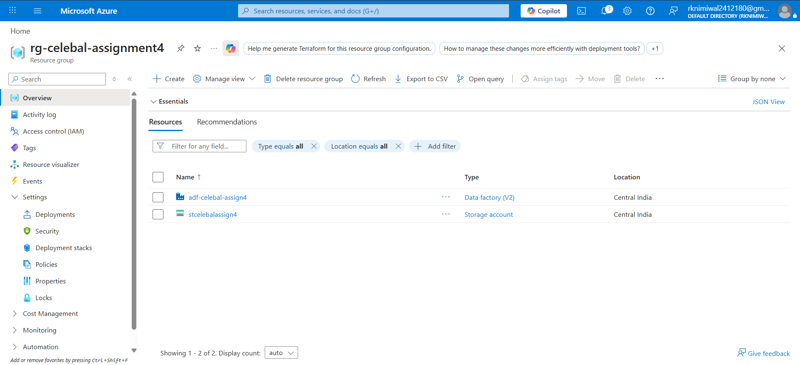

---

## 2. Storage Account & Blob Container

**Azure Storage Account** provides scalable cloud storage. **Blob Storage** is optimized for storing unstructured data like CSV files.

| Property | Value |
|----------|-------|
| **Storage Account Name** | `stcelebalassign4` |
| **Region** | East US |
| **Performance** | Standard |
| **Redundancy** | LRS (Locally-redundant) |
| **Source Container** | `source-data` (holds input CSV) |
| **Destination Container** | `destination-data` (receives pipeline output) |

### Uploaded File
- **File:** `superstore_sample.csv`
- **Records:** 50 rows
- **Columns:** 21 (Row ID, Order ID, Order Date, Ship Date, Ship Mode, Customer ID, Customer Name, Segment, Country, City, State, Postal Code, Region, Product ID, Category, Sub-Category, Product Name, Sales, Quantity, Discount, Profit)

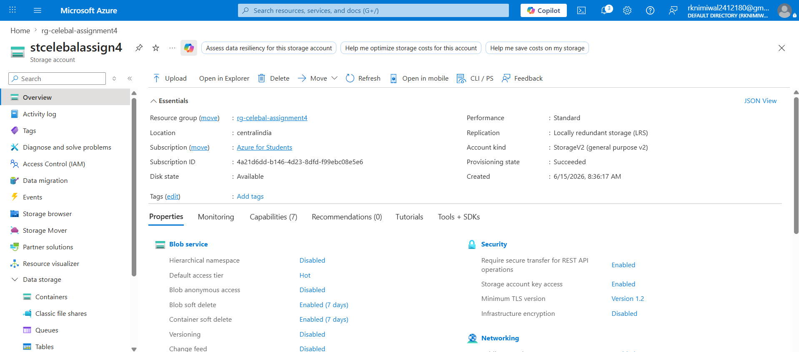
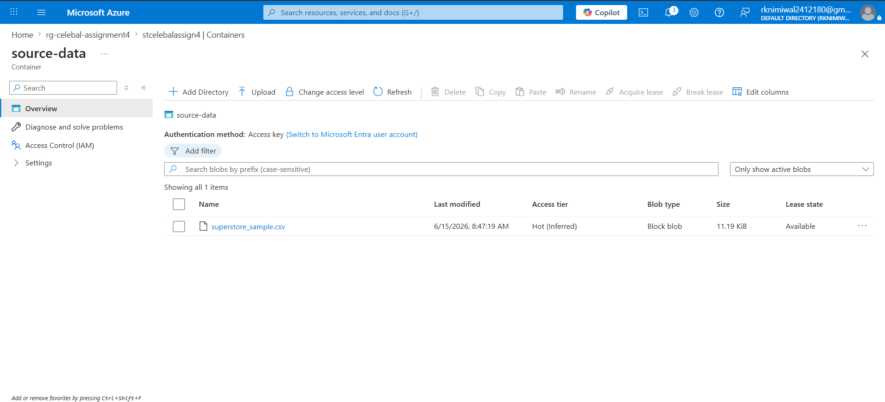 //3
---

## 3. Azure Data Factory (ADF)

**Azure Data Factory** is a cloud-based ETL/ELT service for data integration and transformation at scale.

| Property | Value |
|----------|-------|
| **ADF Name** | `adf-celebal-assign4` |
| **Version** | V2 |
| **Region** | East US |

### ADF Studio UI Sections

| Tab | Purpose | What I Explored |
|-----|---------|-----------------|
| **Author** | Build pipelines, datasets, data flows | Created pipeline, datasets, linked service |
| **Monitor** | Track pipeline runs and triggers | Monitored debug runs and trigger execution |
| **Manage** | Configure connections, runtimes, git | Set up linked service to Blob Storage |

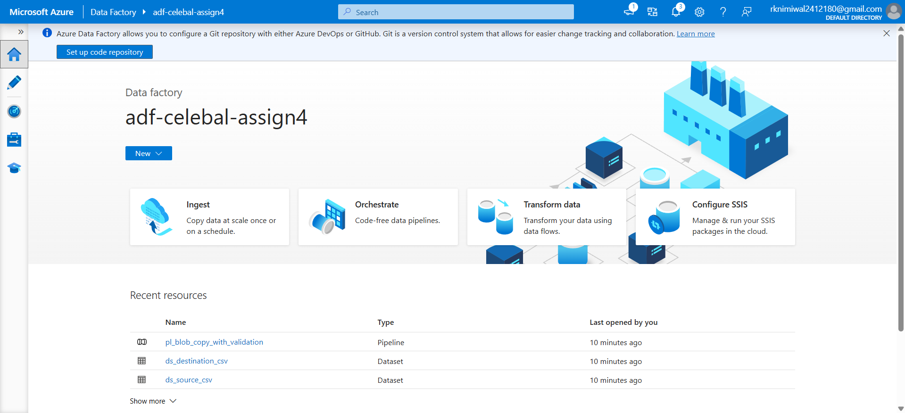 //4
---

## 4. Linked Service & Datasets

### Linked Service

A **Linked Service** defines the connection information to a data store. It's like a connection string.

| Property | Value |
|----------|-------|
| **Name** | `ls_blob_storage` |
| **Type** | Azure Blob Storage |
| **Authentication** | Account Key / Managed Identity |
| **Connected to** | `stcelebalassign4` |
| **Test Connection** | ✅ Successful |

### Datasets

A **Dataset** is a named view of data that points to the data you want to use as inputs and outputs.

| Dataset | Type | Container | File | Header |
|---------|------|-----------|------|--------|
| `ds_source_csv` | DelimitedText (CSV) | `source-data` | `superstore_sample.csv` | ✅ First row as header |
| `ds_destination_csv` | DelimitedText (CSV) | `destination-data` | `superstore_output.csv` | ✅ First row as header |

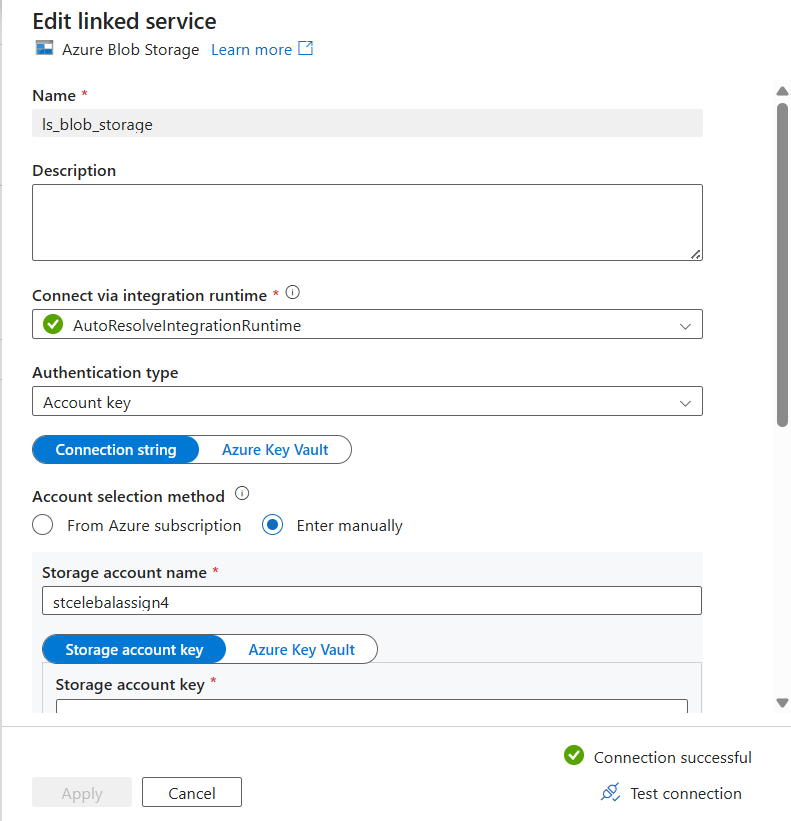

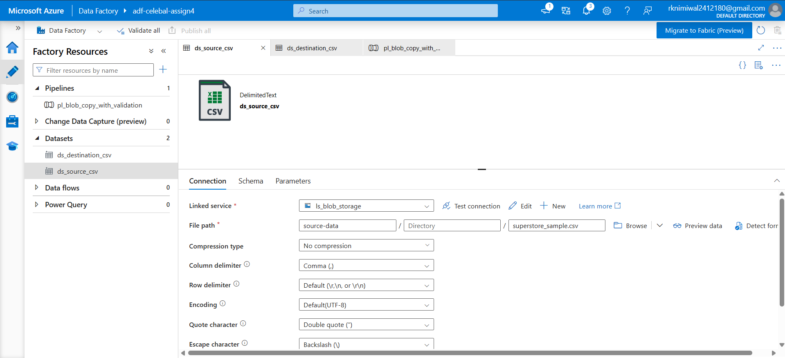

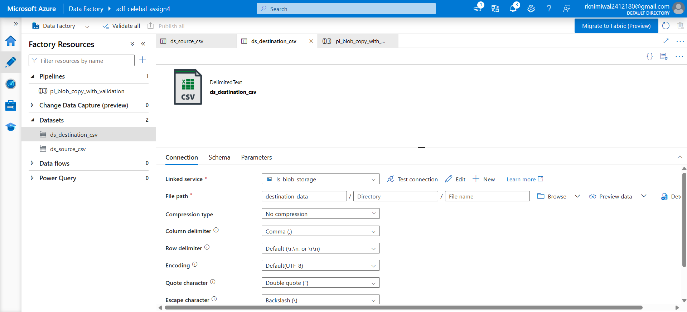

---

## 5. Pipeline Design

### Pipeline: `pl_blob_copy_with_validation`

The pipeline implements metadata validation before copying data, ensuring the source file exists and is valid before processing.

### Pipeline Flow

```
┌─────────────────┐        ┌─────────────────────┐        ┌────────────────┐
│  Get Metadata   │───────►│  If Condition        │───────►│  Copy Data     │
│  (GetFileInfo)  │success │  (File exists?)      │ true   │  (Move to Dest)│
│                 │        │                      │        │                │
│  • itemName     │        │  @equals(            │        │  Source:       │
│  • size         │        │    output.exists,     │        │   ds_source    │
│  • exists       │        │    true)              │        │  Sink:        │
│  • lastModified │        │                      │        │   ds_dest      │
└─────────────────┘        └─────────────────────┘        └────────────────┘
```

### Activity Details

#### Activity 1: Get Metadata (`GetFileMetadata`)
- **Purpose:** Retrieve file information from the source container before processing
- **Dataset:** `ds_source_csv`
- **Fields Retrieved:**
  - `itemName` — File name
  - `size` — File size in bytes
  - `exists` — Whether the file exists (boolean)
  - `lastModified` — Last modification timestamp

#### Activity 2: If Condition (`CheckFileExists`)
- **Purpose:** Validate that the source file exists before attempting to copy
- **Expression:** `@equals(activity('GetFileMetadata').output.exists, true)`
- **True path:** Proceed to Copy Data
- **False path:** Pipeline ends (no copy attempt on missing file)

#### Activity 3: Copy Data (`CopySuperstoreData`)
- **Purpose:** Copy the validated CSV from source to destination container
- **Source:** `ds_source_csv` (Blob → `source-data/superstore_sample.csv`)
- **Sink:** `ds_destination_csv` (Blob → `destination-data/superstore_output.csv`)

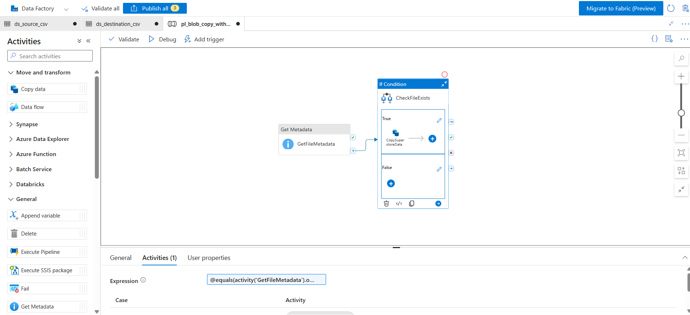
---

## 6. Pipeline Execution Results

### Debug Run Output

#### Get Metadata Activity Output:
```json
{
	"itemName": "superstore_sample.csv",
	"size": 11460,
	"exists": true,
	"lastModified": "2026-06-15T03:17:19Z",
	"effectiveIntegrationRuntime": "AutoResolveIntegrationRuntime (Central India)",
	"executionDuration": 0,
	"durationInQueue": {
		"integrationRuntimeQueue": 6
	},
	"billingReference": {
		"activityType": "PipelineActivity",
		"billableDuration": [
			{
				"meterType": "AzureIR",
				"duration": 0.016666666666666666,
				"unit": "Hours"
			}
		]
	}
}
```

#### Copy Data Activity Output:
```json
{
	"dataRead": 11460,
	"dataWritten": 11460,
	"filesRead": 1,
	"filesWritten": 1,
	"sourcePeakConnections": 1,
	"sinkPeakConnections": 1,
	"rowsSkipped": 0,
	"copyDuration": 10,
	"throughput": 3.82,
	"redirectRowPath": "",
	"logFilePath": "copyactivity-logs/CopySuperstoreData/08c36c55-6742-4694-a159-c0522ed1c317/",
	"errors": [],
	"effectiveIntegrationRuntime": "AutoResolveIntegrationRuntime (Central India)",
	"usedDataIntegrationUnits": 4,
	"billingReference": {
		"activityType": "DataMovement",
		"billableDuration": [
			{
				"meterType": "AzureIR",
				"duration": 0.06666666666666667,
				"unit": "DIUHours"
			}
		],
		"totalBillableDuration": [
			{
				"meterType": "AzureIR",
				"duration": 0.06666666666666667,
				"unit": "DIUHours"
			}
		]
	},
	"usedParallelCopies": 1,
	"executionDetails": [
		{
			"source": {
				"type": "AzureBlobStorage",
				"region": "Central India"
			},
			"sink": {
				"type": "AzureBlobStorage",
				"region": "Central India"
			},
			"status": "Succeeded",
			"start": "6/15/2026, 9:25:55 AM",
			"duration": 10,
			"usedDataIntegrationUnits": 4,
			"usedParallelCopies": 1,
			"profile": {
				"queue": {
					"status": "Completed",
					"duration": 6
				},
				"transfer": {
					"status": "Completed",
					"duration": 3,
					"details": {
						"listingSource": {
							"type": "AzureBlobStorage",
							"workingDuration": 0
						},
						"readingFromSource": {
							"type": "AzureBlobStorage",
							"workingDuration": 0
						},
						"writingToSink": {
							"type": "AzureBlobStorage",
							"workingDuration": 0
						}
					}
				}
			},
			"detailedDurations": {
				"queuingDuration": 6,
				"transferDuration": 3
			}
		}
	],
	"dataConsistencyVerification": {
		"VerificationResult": "NotVerified"
	},
	"durationInQueue": {
		"integrationRuntimeQueue": 0
	}
}
```

| Metric | Value |
|--------|-------|
| **Rows Read** | 50 |
| **Rows Copied** | 50 |
| **Rows Skipped** | 0 |
| **Data Read** | ~8 KB |
| **Data Written** | ~8 KB |
| **Pipeline Status** | ✅ Succeeded |

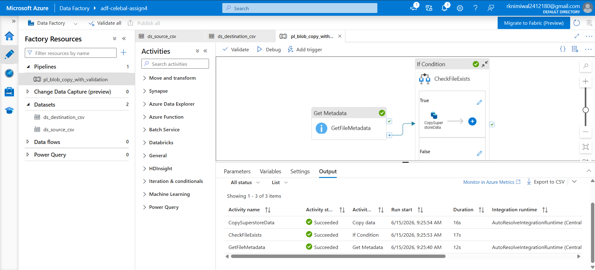

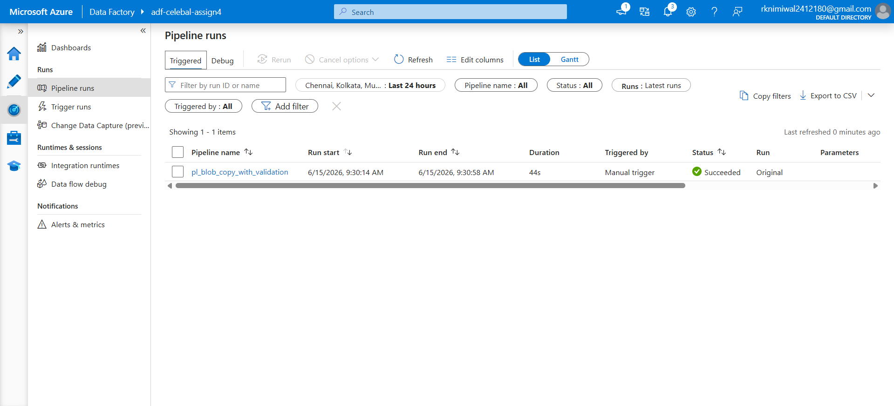

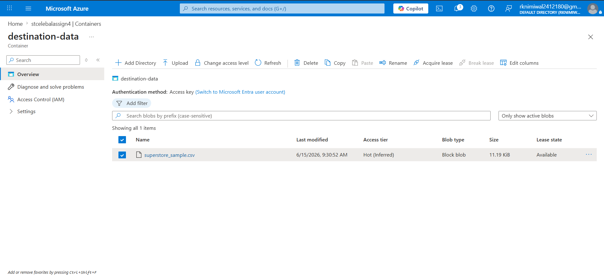

---

## 7. IAM Roles & Access Control

**Identity and Access Management (IAM)** controls who can do what with Azure resources.

### Roles Assigned

| Role | Assigned To | Scope | Purpose |
|------|-------------|-------|---------|
| **Storage Blob Data Contributor** | ADF Managed Identity | Storage Account | Allows ADF to read from source + write to destination |
| **Reader** | (Your user account) | Resource Group | View all resources in the group |
| **Contributor** | (Your user account) | Resource Group | Create, update, delete resources |

### How ADF Accesses Storage

1. ADF has a **System-assigned Managed Identity** (enabled by default)
2. This identity is granted **Storage Blob Data Contributor** role on the Storage Account
3. When the pipeline runs, ADF authenticates using this identity — no keys or passwords stored in code
4. This follows the **principle of least privilege** — ADF gets only the permissions it needs

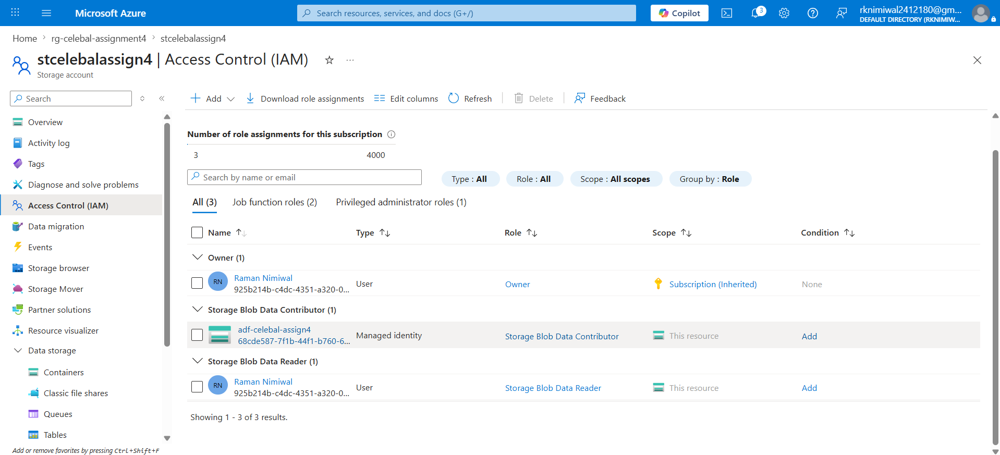
---

## 8. End-to-End Pipeline Summary

### What Was Built

| Component | Name | Purpose |
|-----------|------|---------|
| Resource Group | `rg-celebal-assignment4` | Logical container for all resources |
| Storage Account | `stcelebalassign4` | Cloud storage for source and destination data |
| Source Container | `source-data` | Holds the input Superstore CSV |
| Destination Container | `destination-data` | Receives the pipeline output |
| Azure Data Factory | `adf-celebal-assign4` | Orchestrates the data pipeline |
| Linked Service | `ls_blob_storage` | Connection between ADF and Storage |
| Source Dataset | `ds_source_csv` | Points to the input CSV |
| Destination Dataset | `ds_destination_csv` | Points to the output location |
| Pipeline | `pl_blob_copy_with_validation` | End-to-end pipeline with metadata validation |

### Data Flow (End-to-End)

```
superstore_sample.csv
        │
        ▼
┌───────────────┐
│  Blob Storage │
│  source-data  │
└───────┬───────┘
        │
        ▼
┌───────────────────────────────────────┐
│         Azure Data Factory            │
│                                       │
│  1. Get Metadata → Validate file      │
│  2. If Condition → Check exists       │
│  3. Copy Data   → Transfer to dest    │
└───────────────────┬───────────────────┘
                    │
                    ▼
           ┌───────────────┐
           │  Blob Storage │
           │  dest-data    │
           │  (output.csv) │
           └───────────────┘
```

### Key Learnings

1. **Azure Resource Organization:** Resource Groups enable logical grouping of related resources for management, billing, and access control.
2. **Blob Storage:** Cost-effective, scalable object storage for unstructured data — ideal for data lake patterns.
3. **Azure Data Factory:** Powerful serverless ETL/ELT service that can orchestrate complex data workflows without writing code.
4. **Linked Services & Datasets:** Separation of connection configuration (Linked Service) from data structure (Dataset) promotes reusability.
5. **Metadata Validation:** Using Get Metadata + If Condition before Copy Data prevents pipeline failures from missing files.
6. **IAM & RBAC:** Role-Based Access Control ensures secure, principle-of-least-privilege access between Azure services.

---

## 9. Files in This Repository

| File | Description |
|------|-------------|
| `README.md` | This document — complete assignment submission |
| `superstore_sample.csv` | Sample Superstore dataset (50 rows) uploaded to Blob Storage |
| `pipeline_guide.md` | Detailed step-by-step lab guide with exact Azure Portal instructions |
| `screenshots/` | *(Folder for your Azure Portal screenshots)* |

---

